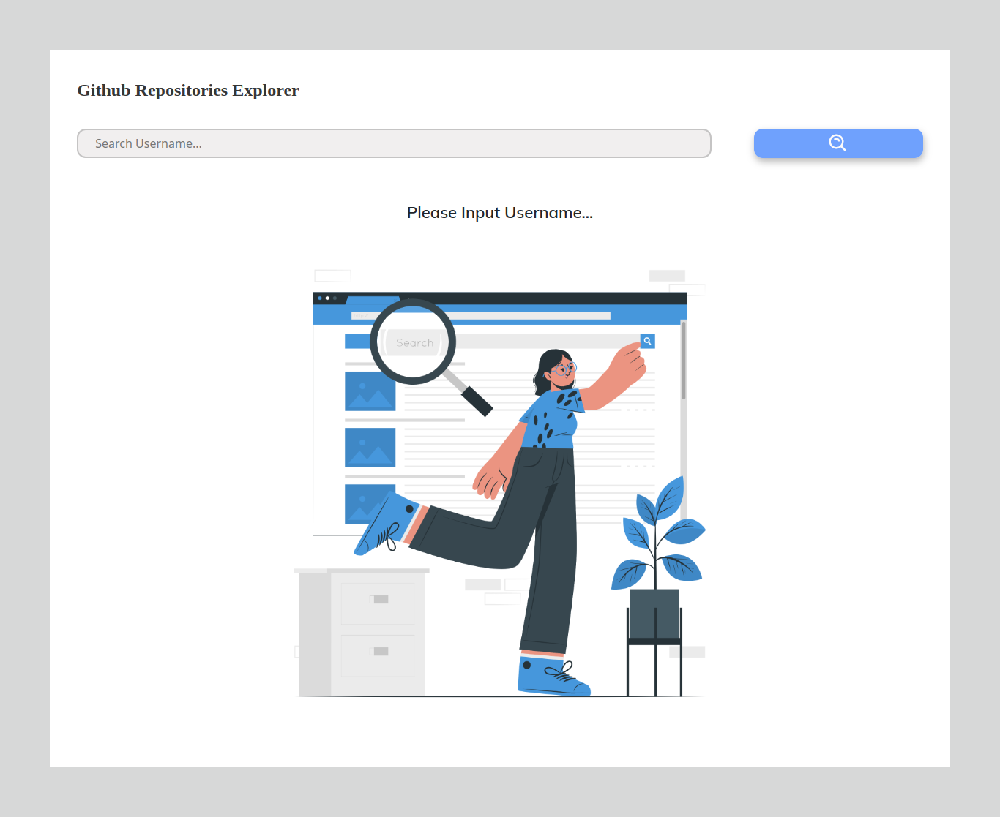
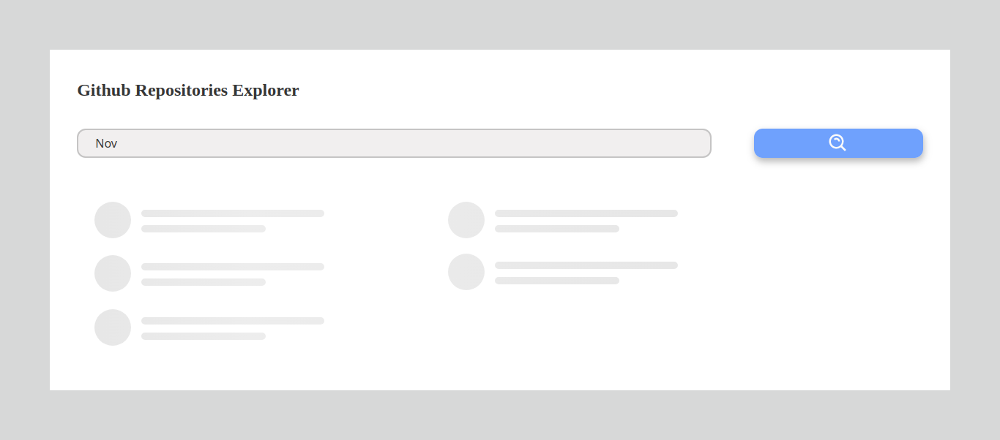
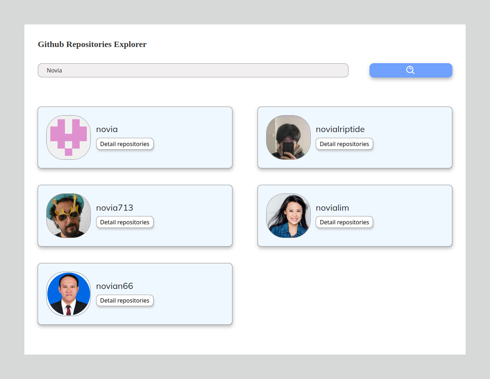
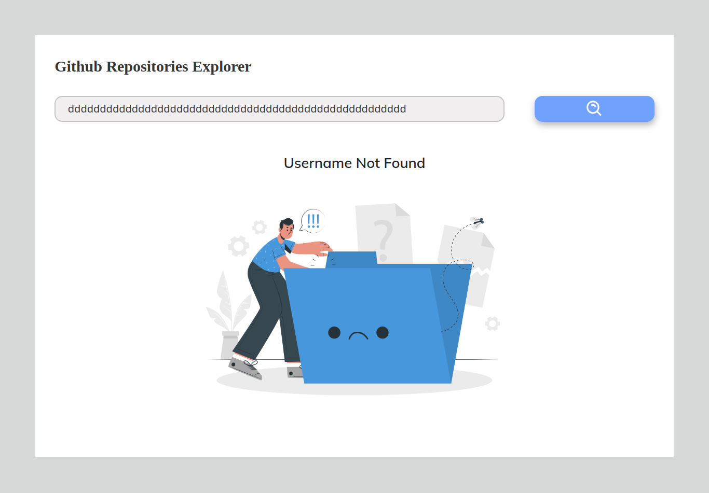
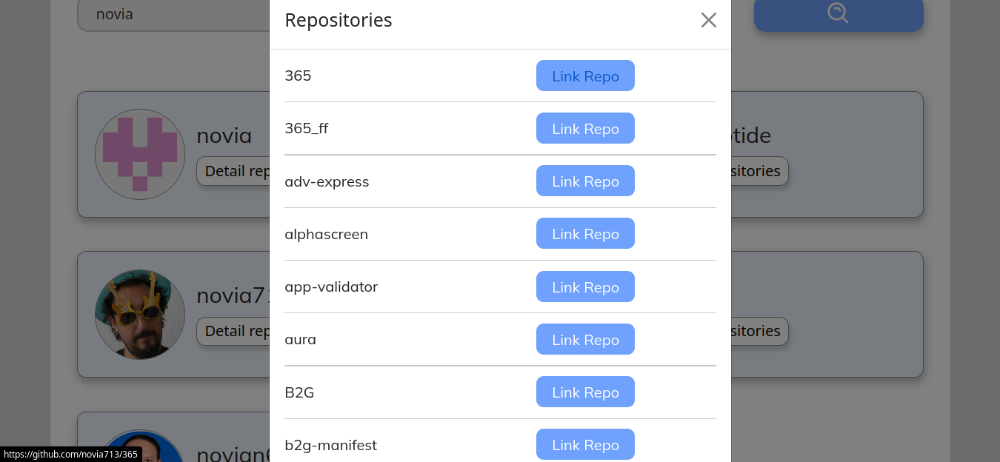
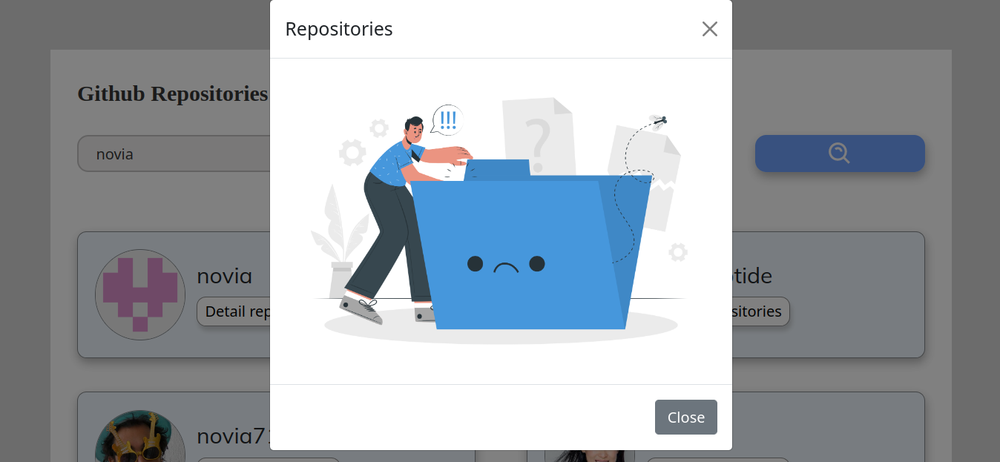

<!-- Improved compatibility of back to top link: See: https://github.com/othneildrew/Best-README-Template/pull/73 -->
<a name="readme-top"></a>
<!--
*** Thanks for checking out the Best-README-Template. If you have a suggestion
*** that would make this better, please fork the repo and create a pull request
*** or simply open an issue with the tag "enhancement".
*** Don't forget to give the project a star!
*** Thanks again! Now go create something AMAZING! :D
-->


<!-- PROJECT SHIELDS -->
<!--
*** I'm using markdown "reference style" links for readability.
*** Reference links are enclosed in brackets [ ] instead of parentheses ( ).
*** See the bottom of this document for the declaration of the reference variables
*** for contributors-url, forks-url, etc. This is an optional, concise syntax you may use.
*** https://www.markdownguide.org/basic-syntax/#reference-style-links
-->
[![Contributors][contributors-shield]][contributors-url]
[![Forks][forks-shield]][forks-url]
[![Stargazers][stars-shield]][stars-url]
[![LinkedIn][linkedin-shield]][linkedin-url]


<!-- PROJECT LOGO -->
<br />
<div align="center">
<h3 align="center">Explorer Github Repositories</h3>

  <p align="center">
    <br />
    <a href="https://github.com/Novianaa/github-repositories-explorer"><strong>Explore the docs »</strong></a>
    </p>
</div>


<!-- TABLE OF CONTENTS -->
<details>
  <summary>Table of Contents</summary>
  <ol>
    <li>
      <a href="#about-the-project">About The Project</a>
      <ul>
        <li><a href="#built-with">Built With</a></li>
      </ul>
    </li>
    <li>
      <a href="#getting-started">Getting Started</a>
      <ul>
        <li><a href="#relation">Relation</a></li>
        <li><a href="#installation">Installation</a></li>
      </ul>
    </li>
    <li><a href="#usage">Usage</a></li>
    <li><a href="#contact">Contact</a></li>
  </ol>
</details>


<!-- ABOUT THE PROJECT -->
## About The Project

I am building a website to be able to search github users and their repositories.

<p align="right">(<a href="#readme-top">back to top</a>)</p>


### Built With
* [react.js](https://react.dev/)
* [axios](https://www.npmjs.com/package/axios)
* [react-redux](https://www.npmjs.com/package/react-redux)
* [redux](https://www.npmjs.com/package/redux)
* [redux-persist](https://www.npmjs.com/package/redux-persist)


<p align="right">(<a href="#readme-top">back to top</a>)</p>


<!-- GETTING STARTED -->
## Getting Started<hr />

### Installation

1. Clone the repo
   ```sh
   git clone https://github.com/Novianaa/github-repositories-explorer.git
   ```
2. Install NPM packages
   ```sh
   npm install / yarn install
   ```
3. Then, you can running this project with the command below
   ```sh
   npm start / yarn start
   ```

<p align="right">(<a href="#readme-top">back to top</a>)</p>


<!-- USAGE EXAMPLES -->
## Usage
[Link deploy](https://noviana-github-repositories-explorer.vercel.app/)

| Screen name                             | Screenshot                                                  |
| --------------------------------------- | ----------------------------------------------------------- |
| Landing page                                  |             |
| When you input username |  |
| the username exist                         |  |
| the username doesn't exist         |      |
| Repos exist         |     |
| Repo doesn't exist         |     |


<p align="right">(<a href="#readme-top">back to top</a>)</p>


## Contact

Noviana Rahmawati -  noviana.rahmawati80@gmail.com

Project Link: [https://github.com/Novianaa/github-repositories-explorer](https://github.com/Novianaa/github-repositories-explorer)

<p align="right">(<a href="#readme-top">back to top</a>)</p>


<!-- MARKDOWN LINKS & IMAGES -->
<!-- https://www.markdownguide.org/basic-syntax/#reference-style-links -->
[contributors-shield]: https://img.shields.io/github/contributors/Novianaa/github-repositories-explorer?style=for-the-badge
[contributors-url]: https://github.com/Novianaa/github-repositories-explorer/graphs/contributors
[forks-shield]: https://img.shields.io/github/forks/Novianaa/github-repositories-explorer?style=for-the-badge
[forks-url]: https://github.com/Novianaa/github-repositories-explorer/network/members
[stars-shield]: https://img.shields.io/github/stars/Novianaa/github-repositories-explorer?style=for-the-badge
[stars-url]: https://github.com/Novianaa/github-repositories-explorer/stargazers
[linkedin-shield]: https://img.shields.io/badge/-LinkedIn-black.svg?style=for-the-badge&logo=linkedin&colorB=555
[linkedin-url]: https://www.linkedin.com/in/noviana-rahmawati08/